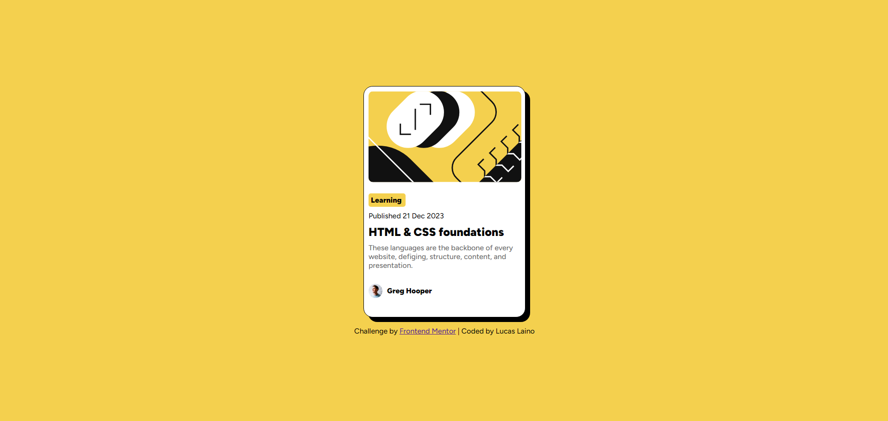

# Frontend Mentor - Blog Preview Card 

Essa é a solução do [Blog preview card challenge on Frontend Mentor](https://www.frontendmentor.io/challenges/blog-preview-card-ckPaj01IcS).

## Conteúdo

- [Visão Geral](#visão-geral)
  - [O Desafio](#o-desafio)
  - [Screenshot](#screenshot)
  - [Links](#links)
- [Meu Processo](#meu-processo)
  - [Construído com](#construído-com)
  - [O que eu aprendi](#o-que-eu-aprendi)
  - [Desenvolvimento Futuro](#desenvolvimento-futuro)
- [Autor](#autor)

## Visão Geral

### Desafio

- O desafio constitui em construir o projeto com os designs fornecidos pelo frontend mentor chegando o mais perto possível do design original. No projeto nós podemos usar qualquer tipo de ferramenta para ajudar a concluir o desafio.

### Screenshot

### Links

- Live Site URL: [Blog Preview Card](https://lucaslaino.github.io/frontend-mentor-blog-preview-card/)

## Meu Processo

### Construído com

- Tags semânticas do HTML
- CSS
- Flexbox
- [Google Fonts](https://fonts.google.com/) - Para fonte do código

### O que eu aprendi

Esse foi meu segundo projeto do caminho de aprendizado do Frontend Mentor. Mesmo tendo feito dois projetos em um curto periodo, nesse eu travei bem menos e deixei o código mais limpo. Com certeza a prática é muito importante, mais do que ficar apenas estudando.

### Desenvolvimento Futuro

Esse foi meu segundo projeto do caminho de aprendizado do Frontend Mentor. Continuarei praticando e estudando para deixar o código cada vez mais escalável e limpo.

## Autor

- LinkedIn - [Lucas Laino](https://www.linkedin.com/in/lucaslaino/)
- Frontend Mentor - [@Lucas Laino](https://www.frontendmentor.io/home)
